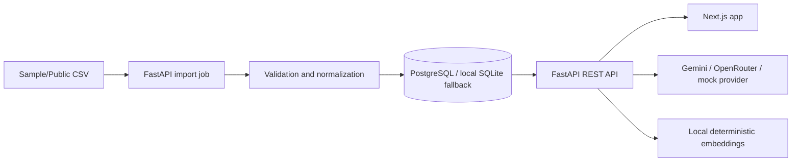

# Architecture

The MVP is a monorepo with a Next.js frontend, FastAPI backend, and PostgreSQL-compatible persistence.

Backend modules are split by responsibility:

- `routers/`: public API endpoints.
- `services/ingestion.py`: CSV mapping, normalization, deduplication, and ingestion counters.
- `services/search.py`: keyword, semantic fallback, and hybrid ranking.
- `services/llm/`: provider abstraction for mock, Gemini, and OpenRouter.
- `services/embeddings.py`: local deterministic embeddings for no-cost semantic demo.
- `models.py`: SQLAlchemy tables matching the procurement domain.
- `routers/health.py`: liveness plus database-backed readiness for production smoke checks.

PostgreSQL is the production target. SQLite is allowed only as a local/test fallback so the app remains runnable without Docker.

The frontend uses query-string locale state, currently `?lang=en` and `?lang=th`, so Vercel can serve the same route tree while preserving language links across navigation.
