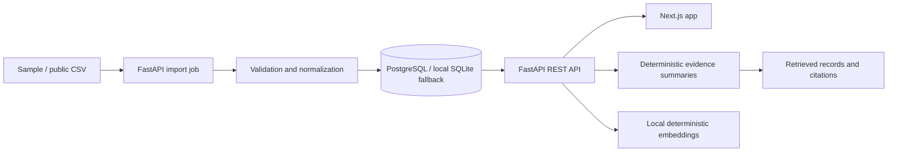

# Architecture

The project is a monorepo with a Next.js frontend, FastAPI backend, and PostgreSQL-compatible persistence.

```mermaid
flowchart LR
  CSV["Sample / public CSV"] --> Import["FastAPI import job"]
  Import --> Normalize["Validation and normalization"]
  Normalize --> DB[("PostgreSQL / local SQLite fallback")]
  DB --> API["FastAPI REST API"]
  API --> Web["Next.js app"]
  API --> Answer["Deterministic evidence summaries"]
  API --> Embed["Local deterministic embeddings"]
  Answer --> Citation["Retrieved records and citations"]
```

Backend modules are split by responsibility:

- `routers/`: public API endpoints.
- `services/ingestion.py`: CSV mapping, normalization, deduplication, and ingestion counters.
- `services/search.py`: keyword, semantic fallback, and hybrid ranking.
- `services/llm/`: deterministic local summary and cited-answer contract retained behind a small interface.
- `services/embeddings.py`: local deterministic embeddings for the no-cost semantic demo.
- `models.py`: SQLAlchemy tables matching the procurement domain.
- `routers/health.py`: liveness plus database-backed readiness for production smoke checks.

The public answer path makes no network inference call. It is intentionally evidence-bound so the same records produce reproducible summaries and citations during review.

PostgreSQL is the production target. SQLite is allowed only as a local/test fallback so the app remains runnable without Docker.

The frontend uses query-string locale state, currently `?lang=en` and `?lang=th`, so the same route tree preserves language links across navigation.
